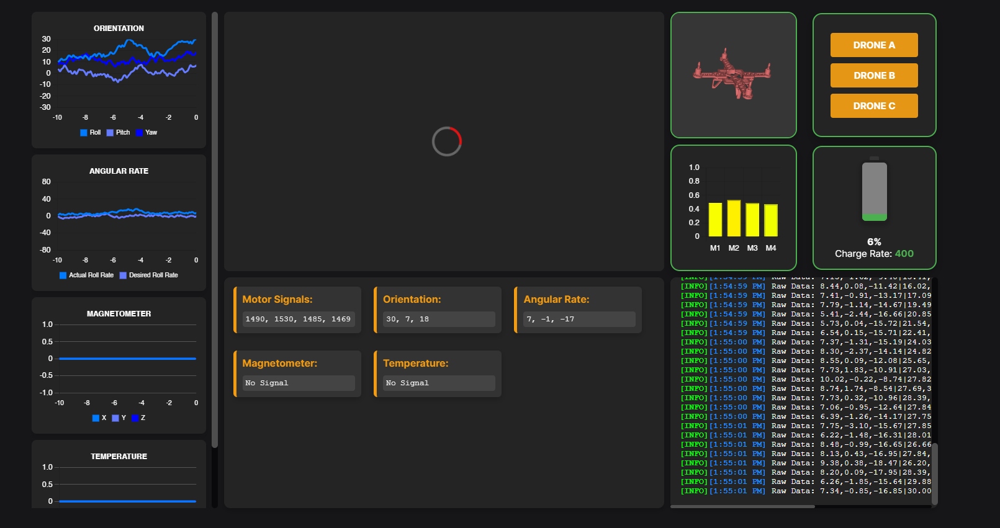

# Image-and-Flight-Data-Server 
## 💼 Overview  
This project was in collaboration with VanWyn Inc., NATO DIANA and the Canadian Department of National Defence. This application includes a node server that communicates with a wired AI driven camera system and a drone via serial connection. The data from these subsystems are visualized and displayed in a graphical user interface (GUI) using graphs and 3D mediums in real time. The application was primarily developed using HTML, CSS, JavaScript, and Node.js, along with additional tools like npm, Electron, Babel, and Webpack.

<!--  -->

## ▶️ Running The Demo 

### ⚙️ Setup 
   1. Install [**Node.js**][node.js]
   2. Open **Command Prompt** in the project root directory
   3. Run the following command <code>npm install</code> and wait for it to finish 
   4. Once the above command completes, run: <code>npm build</code>
   5. Wait for the setup to finish 
### 🖥️ Starting the application 
   1. Open **Command Prompt** in the project root directory
   2. Run the command <code>npm start</code>. This will startup the application.
   3. In the application, under the **Settings** tab, navigate to **Serial Ports** and select **Mock Serial Port**
   4. Navigate to the **Charts** page
### 🕹️ Setup Arduino - *Optional*
   1. Plug in an Arduino
   2. Upload [**ground_station.ino** ][arduino_code] to the Arduino
   3. In the application, under the **Settings** tab, navigate to **Serial Ports** and select your desired port

## 📋 Documentation  
Navigate to the [**documentation**][docs] folder to review the hazard analysis, software requirements specification, and software design documents for this project.

## 🔮 Future Development  
### 📡 Radio Communication System 
- The computer requires a wired connection to the drone's main processor to display data
- We are currently developing a communication system that can wirelessly communicate with the drone 

<!-- File Links -->
[src/main]: src/main
[arduino_code]: others/arduino/ground_station/ground_station.ino
[index.html]: public/index.html
[node.js]: https://nodejs.org
[docs]: documentation
